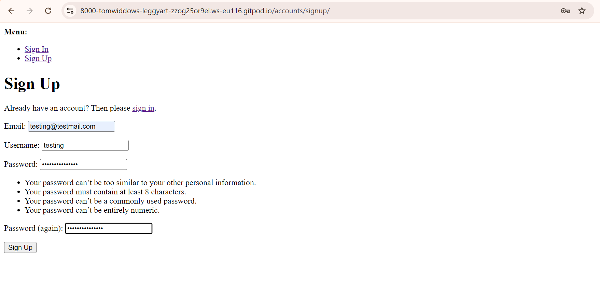
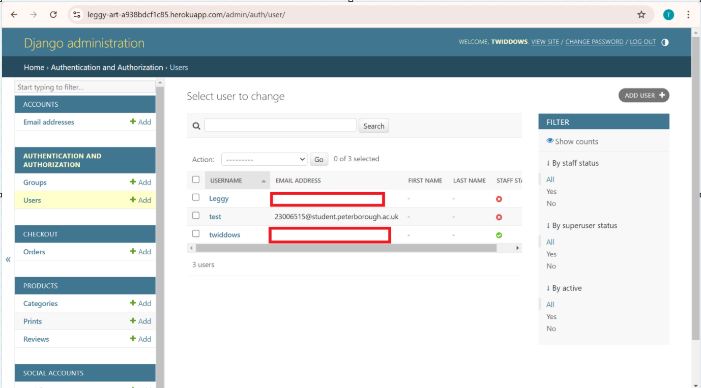
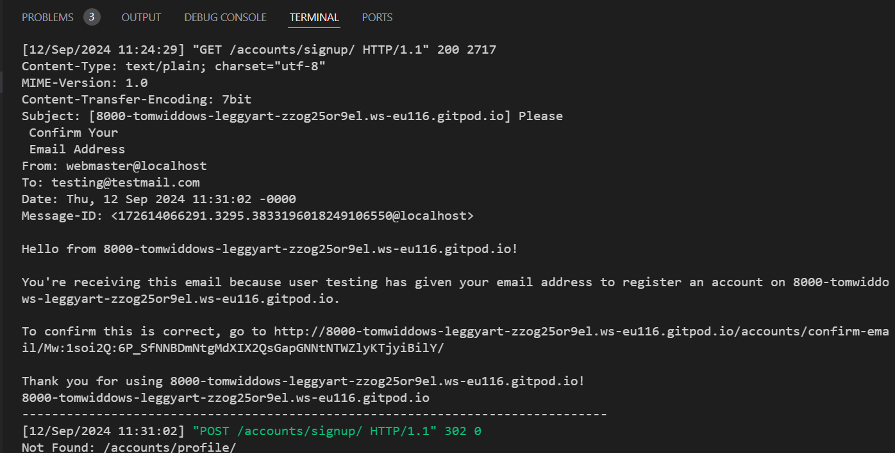
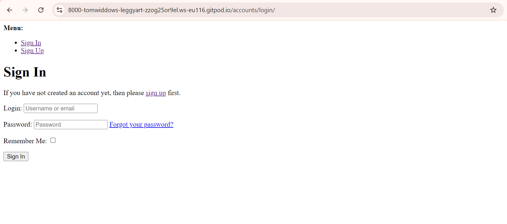
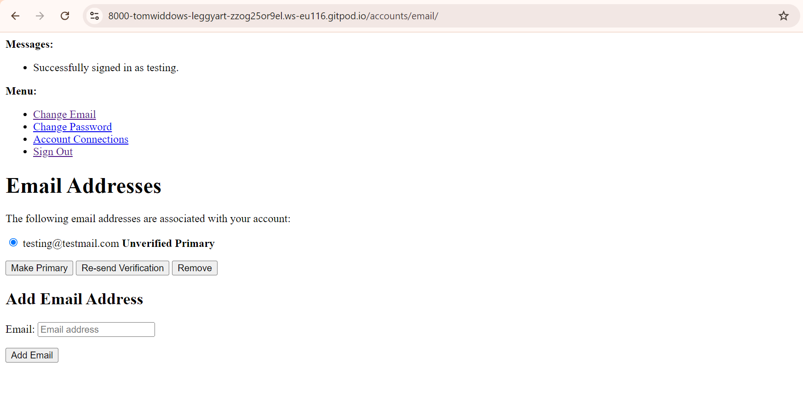
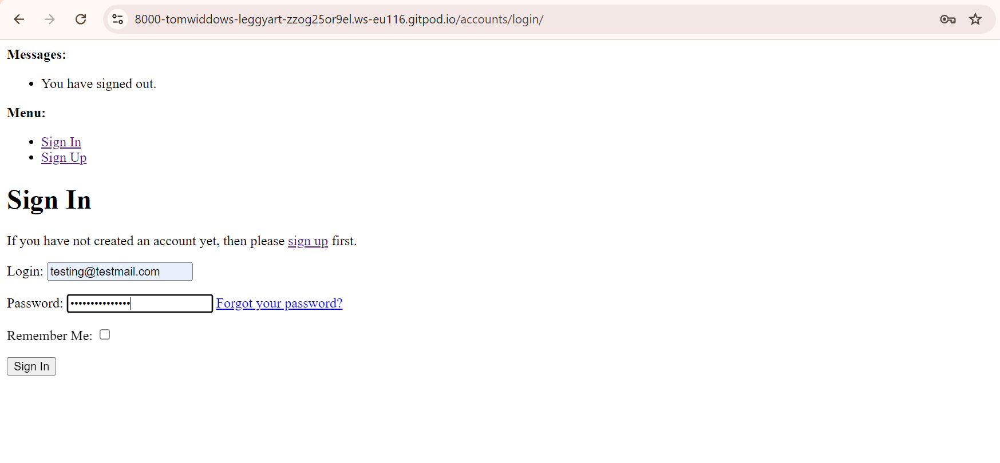

# Testing

## User Stories

## Registration

- As a new shopper, I want to be able to register with an email or social account
- As a newly registered shopper, I want to receive a confirmation email upon registration

Upon registering, an email confirmation should be sent to the user. At the time of writing this, The email is only printed to the console. This will eventually be updated to actually send an email. For now, I am just testing that the user has been added to the users databse and that the 'email' is printed to the console. If both of these things occur, I can confirm that this part of my registration system works correctly.

<figure>
  
  <figcaption>Signup form with username, email, password and retype password all filled.</figcaption>
</figure>
<figure>
  
  <figcaption>Admin page displaying Users.</figcaption>
</figure>
<figure>
  
  <figcaption>Terminal displaying confirmation email.</figcaption>
</figure>

Upon Signup, the account with username testing and email testing@testmail.com has been added to the users database. Furthermore, the email was sent to the console. Then, the form info is posted to /accounts/signup and finally an attempt to redirect to acccounts/profile is made. This page is yet to exist and so the redirect functionality will be tested later.

I have not yet implemented the social account registration method.

## Login

- As a returning shopper, I want to be able to login quickly
- As a returning shopper, I want the option to sign in with my username, email or social account
- As a returning shopper, I want the option for the site to remember me on the browser I am using

<figure>
  
  <figcaption>Sign-up form with placeholder text showing.</figcaption>
</figure>

The placeholder text suggests that either the username or email can be used to log in using the form.

<figure>
  
  <figcaption>Sign-up form with username filled.</figcaption>
</figure>

As I am yet to create the profile template, signing in produces a 404 Page Not Found error. However, this still confirms that the login process has occurred correctly. I can also manually redirect back to the /accounts/ page, which defaults to /accounts/email/ if signed in. The following page is displayed, confirming that the user is logged in as 'testing'

<figure>
  
  <figcaption>Signed in page.</figcaption>
</figure>

I then signed out and attempted the same process using the email to sign in instead of the username and acheieved the same results. 

<figure>
  
  <figcaption>Signed in page.</figcaption>
</figure>