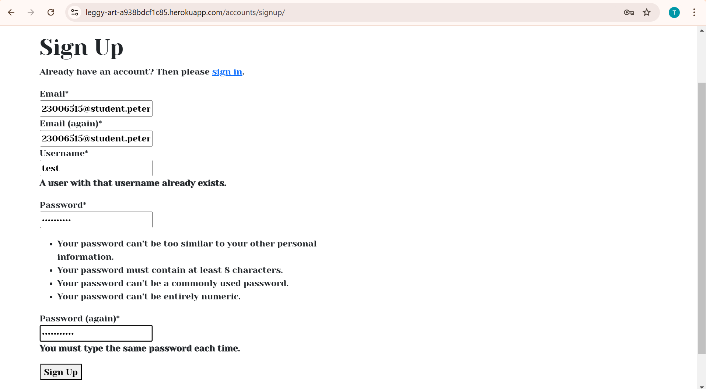
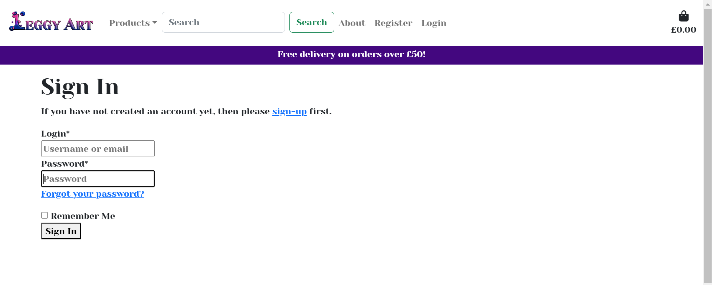

# Testing

Return back to the [README.md](README.md) file.

## User Stories Testing

| User Story | 
Screenshot(s)
 | Comments/Fixes |
| --- | --- | --- |
| As a new shopper, I want to know what the site is about within seconds |  | Hero image displays framed prints. Logo informs the page is for artwork. |
| As a new shopper, I want the site navigation to clear and intuitive |   | All navigation links working. Links changing colour on hover for accessibility |
| As a new shopper, I might want to find out information about the artist in an 'About' page |  | About page contains ralevant info |
| As a new shopper, I want to be able to register with an email or social account |  | Social account signup functionality not yet implemented, as discussed in README.md future features section |
| As a newly registered shopper, I want to receive a confirmation email upon registration |  | Confirmation email sent with link to finalise process |
| As a returning shopper, I want to be able to login quickly    As a returning shopper, I want the option to sign in with my username, email or social account    As a returning shopper, I want the option for the site to remember me on the browser I am using |  | User has option between username or email. Signin is not complicated and can be accessed within one click of homepage. Remember me button works for given browser |
| As a returning shopper, I want to be able to view my profile page    As a returning shopper, I want to be able to view my previosuly purchased products see reviews and comments I have left on my products |  | Default info showing. Order history showing |
| As a potential customer, I want to be able to view all products or filter the products based on various categories |     | Filter and sort tables. Both work as expected |
| As a potential customer, I want to be able to view more details and an enlarged image of the prints I am interested in |  | Enlarged image slideshow, more detail, ability to alter number of prints to add to basket. |
| As a potential customer, I want to be able to add and remove products from my basket once logged in |  | Ablility to remove and update number of selected prints works as expected |
| As a site administrator, I should be able to add more prints to the website    As a site administrator, I should be able to remove certain prints    As a site administrator, I should be able to edit certain prints  |   | Superusers can add products in management page and edit/delete products via prints/print_detail pages |
| As a site administrator, I should be able to see when a customer has purchased a print |  | Superusers can see all orders in their profile. |

## Code Validation

### HTML

I have used the recommended [HTML W3C Validator](https://validator.w3.org) to validate all of my HTML files. I have validated using the live, deployed site using the live site links shown below.

| Page | Screenshot | Comments |
| --- | --- | --- |
| [Home](https://leggy-art-a938bdcf1c85.herokuapp.com/) |  | The warning is a minor issue, and I have previously encountered issues when not using type="text/javascript" |
| [Prints](https://leggy-art-a938bdcf1c85.herokuapp.com/products/) |  | The error is from bootstrap code |
| [Print detail](https://leggy-art-a938bdcf1c85.herokuapp.com/products/1/) |  | Out-of-place end of anchor tags indentified and removed |
| [Basket](https://leggy-art-a938bdcf1c85.herokuapp.com/basket/) |  | Out-of-place end of div tag indentified and removed |
| [Checkout](https://leggy-art-a938bdcf1c85.herokuapp.com/checkout/) |  | Bootstrap issue |
| [Checkout success](https://leggy-art-a938bdcf1c85.herokuapp.com/checkout/checkout_success/AF2E13773BDB4F498D4A862E3F21AA8E) |  | No issues |
| [About](https://leggy-art-a938bdcf1c85.herokuapp.com/about/) |  | No issues |
| [About](https://leggy-art-a938bdcf1c85.herokuapp.com/about/) |  | No issues |